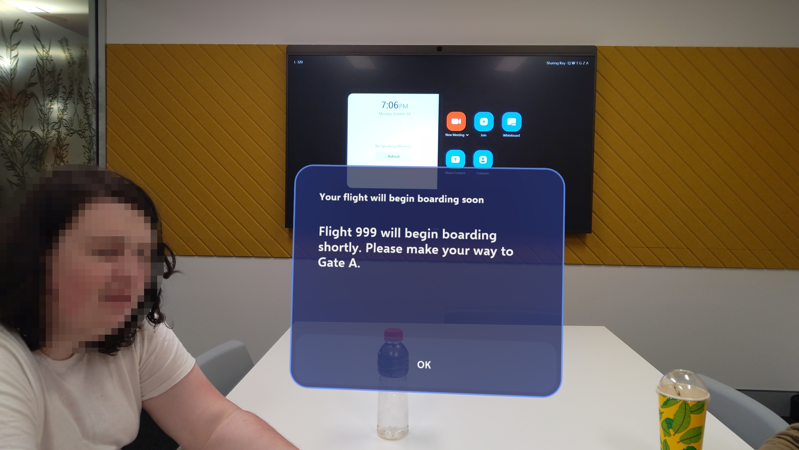

<meta name="viewport" content="width=device-width, initial-scale=1.0, minimum-scale=1.0">


# ARPort

## What is it?

ARPort is a high-fidelity prototype application for the HoloLens 2, targeted at customers and other individuals of international airports. The goal of the application is to simplify the user's experience at an international airport by providing solutions to common problems.

<!-- TODO Add to this; maybe use information from the report? -->

This project was created with the goal of understanding the importance and implementation of design concepts in Human-Computer Interaction (HCI), and to demonstrate the use of AR (Augmented Reality) applications at an international airport when considering a world where AR and HMD (Head-Mounted Display) technology is commonplace.

ARPort was designed and developed in completing [SENG2260](https://www.newcastle.edu.au/course/SENG2260) at the University of Newcastle, Australia.

## Features

ARPort provides protype implementations for the following features:

### Navigation

Assists the user with navigating between landmarks of an international airport. The user can select a landmark from the 'navigation menu' and the application will indicate a direction for the user to travel.

[Microsoft Spatial Anchors](https://learn.microsoft.com/en-us/windows/mixed-reality/design/spatial-anchors) are used to track the landmarks of an international airport. They can be created by accessing the 'Landmark Manager' menu.

<div style="display:flex;flex-direction:row;justify-content:center;align-content:center;padding-top:6px;">

</div>

### Group Tracking

Provides the user with information about their current travel party. The user can access the 'My Group' menu to view the names and locations of each member of their group. Ideally, the user (or member) will have the option to disable sharing their location to the 'My Group' feature temporarily or permanently.

The user can select a member of their group from the 'My Group' menu to invoke the [navigation system](#Navigation) and begin navigation to the location of the selected member.

<div style="display:flex;flex-direction:row;justify-content:center;align-content:center;padding-top:6px;">

</div>

### Notifications Center

<div style="display:flex;flex-direction:row;justify-content:center;align-content:center;padding-top:6px;width:100%;">
 
</div>

### Alerts and Announcements

<div style="display:flex;flex-direction:row;justify-content:center;align-content:center;padding-top:6px;width:100%;">
 
</div>

## Dependencies


## Technologies

The project is created with:

- Unity version 2020.3.38f1 (download from the [Unity download archive](https://unity3d.com/get-unity/download/archive))
- [MRTK3](https://learn.microsoft.com/en-us/windows/mixed-reality/mrtk-unity/mrtk3-overview/)

<picture>
    <source
        srcset="Images/U_Logo_T1_MadeWith_Small_White_RGB.svg"
        media="(prefers-color-scheme: light), (prefers-color-scheme: no-preference), (min-width: 640px)"
    />
    <source
        srcset="Images/U_Logo_T1_MadeWith_Small_Black_RGB.svg"
        media="(prefers-color-scheme: light), (prefers-color-scheme: no-preference), (min-width: 640px)"
    />
    <source
        srcset="Images/U_Logo_T1_MadeWith_White_RGB.svg"
        media="(prefers-color-scheme: dark), (min-width: 768px)"
    />
    <source
        srcset="Images/U_Logo_T1_MadeWith_Black_RGB.svg"
        media="(prefers-color-scheme: light), (prefers-color-scheme: no-preference), (min-width: 768px)"
    />
    
</picture>

<a href="https://learn.microsoft.com/en-us/windows/mixed-reality/mrtk-unity/mrtk3-overview/">
    
</a>

## Setup

You can use this project by doing the following:

1. Clone the repository

    ```bash
    git clone https://github.com/Jadocee/ARPort-High-Fidelity-Prototype
    ```

2. Add the directory of the cloned repo to Unity Hub (see ['How do I add a project saved on my computer into the Unity Hub?'](https://support.unity.com/hc/en-us/articles/4402520287124-How-do-I-add-a-project-saved-on-my-computer-into-the-Unity-Hub-))

*Note: MRTK and other packages are included in the cloned repository and will be imported after opening the project in Unity*


## Run

The project requires that the built project is deployed to either a HoloLens 2 [HMD](https://www.microsoft.com/en-us/hololens/buy) or [Emulator](https://learn.microsoft.com/en-us/windows/mixed-reality/develop/advanced-concepts/using-the-hololens-emulator). Microsoft provides documentation on how to deploy built Unity apps to a HoloLens 2 device or emulator.

It is recommended that the application is built in Unity and deployed using [Visual Studio](https://visualstudio.microsoft.com/vs/) (i.e., select the "Build" option instead of the "Build And Run" option).

[Build and deploy to the HoloLens](https://learn.microsoft.com/en-us/windows/mixed-reality/develop/unity/build-and-deploy-to-hololens) &mdash; Microsoft


## Credits

<p align="left" style="margin: 6px 0 0 0;">Alex Budden</p><a href="https://github.com/Buddostars" alt="Buddostars"><span align="left" style="margin:0;">@Buddostars</p></a>

<p align="left" style="margin: 6px 0 0 0;">Mitchell Gennette</p><a href="https://github.com/Mi-Genn" alt="Mi-Genn"><p align="left" style="margin:0;">@Mi-Genn</p></a>

<p align="left" style="margin: 6px 0 0 0;">Daniel Ruggeri</p><a href="https://github.com/DanielRuggeri" alt="Mi-Genn"><p align="left" style="margin:0;">@DanielRuggeri</p></a>

<p align="left" style="margin: 6px 0 0 0;">Aiden Brown</p><a href="https://github.com/Aiden-Brown" alt="Aiden-Brown"><p align="left" style="margin:0;">@Aiden-Brown</p></a>

<!-- ## References

<div style="display:flex;flex-direction:row;gap:1rem;">
<div style="flex:1;min-width:fit-content;">
[1]
</div>
<div>
<a name="1">V. Bogicevic, W. Yang, C. Cobanoglu, A. Bilgihan, and M. Bujisic, “Traveler anxiety and enjoyment: The effect of airport environment on traveler’s emotions,” Journal of Air Transport Management, vol. 57, pp. 122–129, 2016, issn: 0969-6997. doi: https://doi.org/10.1016/j.jairtraman. 2016.07.019. \[Online\]. Available: <a href="https://www.sciencedirect.com/science/article/pii/S0969699715300697">https://www.sciencedirect.com/science/article/pii/S0969699715300697</a></a>
</div>
</div> -->
